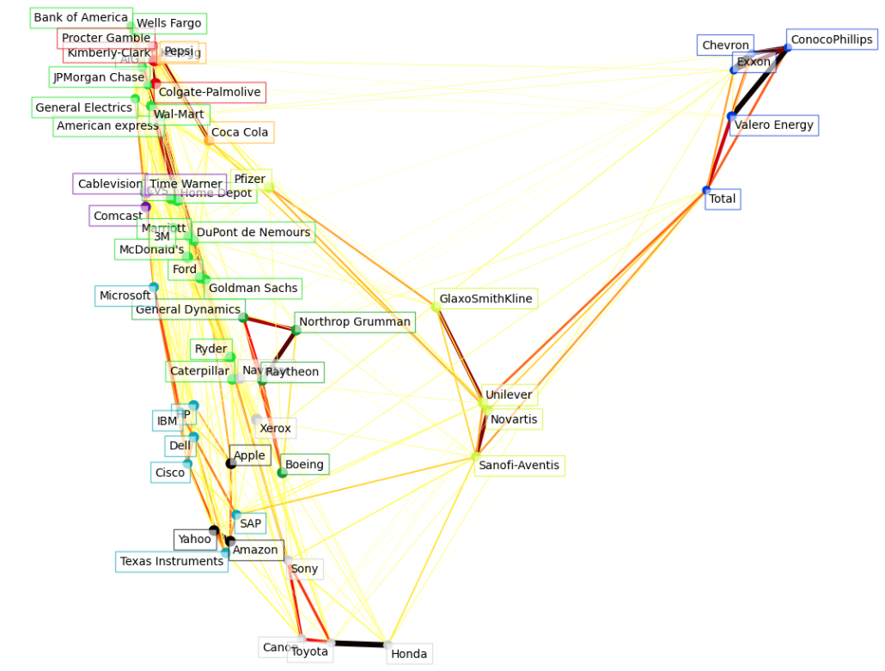

## Visualizing the Stock Market Structure

This project employs several unsupervised learning techniques to extract and visualize the stock market structure based on variations in historical stock prices. The key quantity used is the daily variation in quote prices, with the assumption that correlated quotes tend to fluctuate together during a day.

Modified from the "Visualizing the stock market structure" tutorial provided by scikit-learn.

### Features:
* Data Retrieval: The historical stock price data spans from 2003 to 2008, excluding the 2008 financial crisis to focus on relatively stable periods. This historical data can be obtained from various financial APIs such as data.nasdaq.com and alphavantage.co.
* Learning a Graph Structure: use sparse inverse covariance estimation to identify which quotes are conditionally correlated. This method provides a graph where each node represents a stock symbol, and edges represent conditional dependencies between the stocks. The symbols connected in this graph are those that are useful in explaining the fluctuations of each other.
* Clustering Using Affinity Propagation: This clustering approach provides insights into marginal properties of the stocks, indicating clusters of stocks with similar impacts on the overall stock market.
* Embedding in 2D Space: manifold techniques are used to embed the stock symbols in a 2D space.
* The results from the three models are combined into a comprehensive 2D graph.

    

### Clustered result:
* Cluster 1: Apple, Amazon, Yahoo
* Cluster 2: Comcast, Cablevision, Time Warner
* Cluster 3: ConocoPhillips, Chevron, Total, Valero Energy, Exxon
* Cluster 4: Cisco, Dell, HP, IBM, Microsoft, SAP, Texas Instruments
* Cluster 5: Boeing, General Dynamics, Northrop Grumman, Raytheon
* Cluster 6: AIG, American Express, Bank of America, Caterpillar, CVS, DuPont de Nemours, Ford, General Electric, Goldman Sachs, Home Depot, JPMorgan Chase, Marriott, McDonald's, 3M, Ryder, Wells Fargo, Wal-Mart
* Cluster 7: GlaxoSmithKline, Novartis, Pfizer, Sanofi-Aventis, Unilever
* Cluster 8: Kellogg, Coca-Cola, Pepsi
* Cluster 9: Colgate-Palmolive, Kimberly-Clark, Procter & Gamble
* Cluster 10: Canon, Honda, Navistar, Sony, Toyota, Xerox

 

